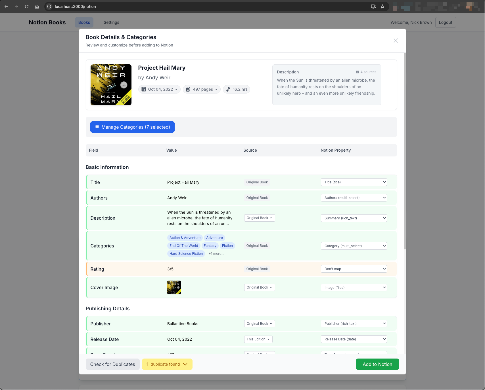
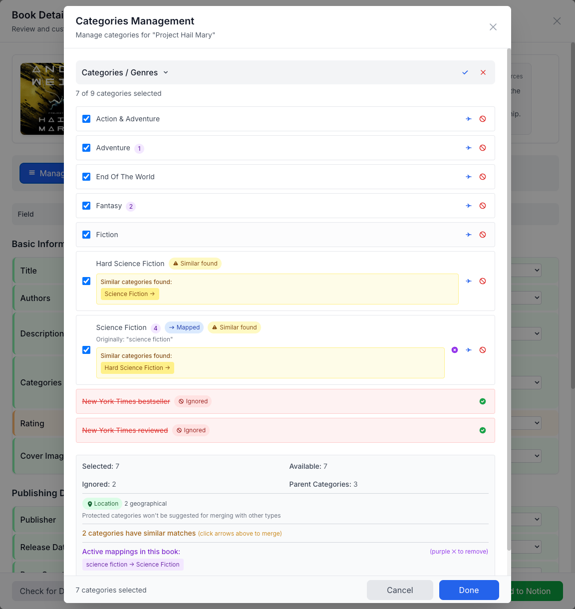

Absolutely. Here is the complete README in raw Markdown format, ready to be copied directly into your `README.md` file.


# Notion Books

A web application that fetches book information from Google Books & Open Library, also includea audiobook data from Audnexus, and adds it to your Notion database after your review.


## ✨ Features

-   **Dual API Integration**: Fetches data from Google Books, with Open Library as a fallback for richer metadata like original publication dates.
-   **Powerful Audiobook Search**: Uses the Audnexus API and Audible's public search for audiobook discovery, without needing an API key. (IP based limits to avoid abuse)
-   **Interactive Data Review**: A comprehensive modal to review, edit, and select data from multiple sources (editions, audiobooks) before adding to Notion.
-   **Smart Category Management**: Automatically processes, splits, and maps genres. Allows you to ignore, merge, and manage categories.

-   **Secure Notion Connection**: Uses a personal Notion integration token for a simple and secure setup.
-   **Custom Field Mapping**: Visually map book data fields to the properties in your Notion database.
-   **Duplicate Detection**: Checks if a book already exists in your Notion database before adding.

## 💻 Tech Stack

-   **Backend**: Node.js, Express, PostgreSQL, Helmet
-   **Frontend**: React, TypeScript, Tailwind CSS, React Router
-   **Data Sources**: Google Books API, Open Library API, Audnexus API, Audible Search API

---

## 🚀 Getting Started

### 1. Prerequisites

-   Node.js v18+
-   Docker & Docker Compose (Recommended)
-   A [Notion Integration Token](#-notion-integration)
-   A [Google Books API Key](#-google-books-api) (Optional, but recommended)

### 2. Local Development

1.  **Clone the repository:**
    ```bash
    git clone https://github.com/nicbrow3/Notion-Books-webapp.git
    cd Notion-Books-webapp
    ```

2.  **Install dependencies:**
    ```bash
    npm run install:all
    ```

3.  **Configure environment variables:**
    -   Copy `backend/env.example` to `backend/.env`.
    -   Fill in your `NOTION_INTEGRATION_TOKEN` and `GOOGLE_BOOKS_API_KEY`.
    -   Set a `SESSION_SECRET`.

4.  **Run the application:**
    ```bash
    npm run dev
    ```
    -   The backend will run on `http://localhost:5000`.
    -   The frontend will run on `http://localhost:3000`.

---

## 🐳 Docker Deployment (Recommended)

This is the easiest way to run the application for personal use (e.g., on a home server or Unraid).

1.  **Create a `docker-compose.yml` file** by copying `docker-compose.template.yml`:
    ```bash
    cp docker-compose.template.yml docker-compose.yml
    ```

2.  **Edit `docker-compose.yml`** and add your API keys:
    ```yaml
    services:
      notion-books:
        # ...
        environment:
          - NOTION_INTEGRATION_TOKEN=secret_your_notion_token_here
          - GOOGLE_BOOKS_API_KEY=your_google_books_api_key_here
          - SESSION_SECRET=a_very_long_and_random_string_for_security
          - FRONTEND_URL=http://YOUR_SERVER_IP:3001 # Replace with your server's IP
    ```

3.  **Start the container:**
    ```bash
    docker-compose up -d
    ```

4.  **Access the application** at `http://YOUR_SERVER_IP:3001`.

<details>
<summary><strong>📦 Unraid Deployment Guide</strong></summary>

1.  **Install Docker Compose Manager**: If not already installed, get it from the "Apps" tab in Unraid.
2.  **Create a New Stack**:
    -   Go to the Docker tab and click "Add Container".
    -   Switch to the "Compose" view.
    -   **Name the stack**: `notion-books`.
3.  **Paste and Edit Compose File**:
    -   Copy the contents of `docker-compose.template.yml` into the compose editor.
    -   Update the `environment` section with your actual API keys and server IP address.
4.  **Start the Stack**: Click "Start" to pull the image and run the container.
5.  **Access**: The app will be available at the IP and port you configured (e.g., `http://192.168.1.10:3001`).

</details>

---

## 🔑 API Configuration

You only need to configure API keys for Notion and Google Books. Audiobook features work automatically.

### Notion Integration

The app uses a **personal integration token**. This is simpler and more secure for personal use than OAuth.

1.  Go to **[My Integrations](https://www.notion.so/my-integrations)**.
2.  Click **"+ New integration"**.
3.  Give it a name (e.g., "Notion Books App") and associate it with your workspace.
4.  On the next screen, copy the **Internal Integration Token** (it starts with `secret_...`).
5.  **Important**: Go to your target database in Notion, click the `•••` menu, and under "Connections", add your new integration.

### Google Books API

This is optional but provides higher-quality search results.

1.  Go to the [Google Cloud Console](https://console.cloud.google.com/).
2.  Create a new project.
3.  Go to "APIs & Services" -> "Library" and enable the **Books API**.
4.  Go to "Credentials" -> "Create Credentials" -> **"API Key"**.
5.  Copy the generated key.

### Audiobook API (Audnexus & Audible)

✅ **No configuration is required!** The application uses the public, key-less Audnexus API for metadata and Audible's search API for discovery. This feature works out-of-the-box.

<details>
<summary><strong>🔌 API Endpoints</strong></summary>

-   `GET /health` - Health check endpoint.
-   `POST /auth/setup` - Set up the Notion connection.
-   `GET /auth/status` - Check authentication status.
-   `POST /auth/logout` - Log out.
-   `GET /api/books/search` - Search for books.
-   `GET /api/books/suggestions` - Get search suggestions.
-   `GET /api/books/editions/:workKey` - Get book editions from Open Library.
-   `GET /api/books/audiobook-search/:title/:author` - Search for audiobook matches.
-   `GET /api/books/audiobook/:asin` - Get full data for a selected audiobook.
-   `GET /api/notion/databases` - List available Notion databases.
-   `GET /api/notion/database/:id/properties` - Get properties for a specific database.
-   `POST /api/notion/pages/book` - Create a new book page in Notion.
-   `PATCH /api/notion/pages/:pageId/book` - Update an existing book page.

</details>

---

## 📄 License

This project is licensed under the MIT License.